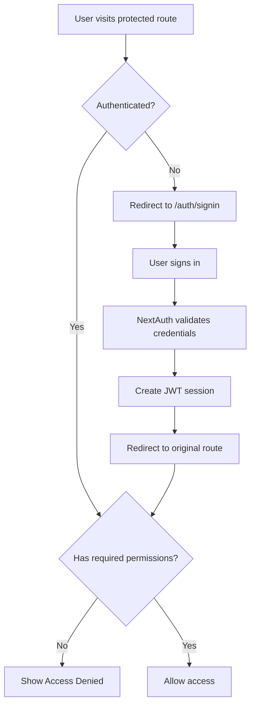

# 🎉 NextAuth Integration - COMPLETE!

The NextAuth.js authentication system has been successfully integrated into the Social Dashboard application. This document summarizes what has been implemented and provides guidance for testing and next steps.

## ✅ What's Been Completed

### 🔐 Core Authentication System
- **NextAuth.js Setup**: Complete configuration with JWT sessions
- **Multiple Providers**: Google OAuth + Credentials (email/password)
- **Environment Configuration**: Secure secrets and configuration
- **Session Management**: 24-hour sessions with 1-hour refresh
- **Authentication Pages**: Sign in, sign out, and error handling

### 🛡️ Security & Authorization  
- **Role-Based Access Control**: Admin, User, Viewer roles
- **Permission System**: Granular permissions per role
- **Security Utilities**: Comprehensive security helper functions
- **Audit Logging**: Track authentication events and user actions
- **Route Protection**: `withAuth` HOC for protected routes
- **Input Validation**: Secure form handling and data sanitization

### 🏗️ Component Integration
- **AuthContext Provider**: Global authentication state management
- **DashboardLayout**: Real user information display with role badges
- **ProfilePage**: NextAuth-integrated user profile management
- **Authentication Guards**: Component-level access control
- **Security Hooks**: `useSecurityUtils`, `useAuditLog`, `useGenerateAssetId`

### 📱 User Interface
- **Professional Auth Pages**: Consistent, branded authentication flows
- **Error Handling**: User-friendly error messages and recovery
- **Loading States**: Proper loading indicators during auth operations
- **Responsive Design**: Mobile-friendly authentication interface

## 🔧 Files Created/Modified

### Core Authentication Files
- `src/contexts/AuthContext.tsx` - Authentication context and providers
- `src/app/api/auth/[...nextauth]/route.ts` - NextAuth configuration
- `src/utils/security.ts` - Security utilities (updated for NextAuth)

### Authentication Pages
- `src/app/auth/signin/page.tsx` - Sign in page
- `src/app/auth/signout/page.tsx` - Sign out confirmation
- `src/app/auth/error/page.tsx` - Error handling page

### Protected Routes
- `src/app/settings/page.tsx` - Protected settings (requires 'write' permission)
- `src/app/admin/page.tsx` - Admin-only page (requires 'admin' role)

### UI Components
- `src/components/ui/Input.tsx` - Form input component
- `src/components/ui/Label.tsx` - Form label component  
- `src/components/ui/Textarea.tsx` - Textarea component
- `src/utils/cn.ts` - Class name utility for styling

### Updated Components
- `src/components/layout/DashboardLayout.tsx` - Real user data display
- `src/components/settings/ProfilePage.tsx` - NextAuth integration
- `src/app/layout.tsx` - AuthProvider integration

### Configuration & Documentation
- `.env.local.example` - Environment variable template
- `.env.local` - Development environment (created)
- `AUTHENTICATION_SETUP.md` - Setup and configuration guide
- `AUTHENTICATION_TESTING.md` - Comprehensive testing guide

## 🚀 Ready to Test

### Test URLs
- **Authentication Test**: http://localhost:3000/test
- **Sign In**: http://localhost:3000/auth/signin  
- **Settings** (protected): http://localhost:3000/settings
- **Admin Panel** (admin-only): http://localhost:3000/admin
- **Main Dashboard**: http://localhost:3000/

### Test Accounts
```
Admin Account:
- Email: admin@socialdashboard.com
- Password: admin123!
- Permissions: All (read, write, delete, admin)

User Account:  
- Email: user@socialdashboard.com
- Password: user123!
- Permissions: read, write, delete_own
```

### Key Features to Test
1. **Sign In/Out Flow**: Test credentials authentication
2. **Role-Based Access**: Compare admin vs user permissions
3. **Route Protection**: Try accessing `/admin` as different roles
4. **Security Utilities**: Use test page to validate functions
5. **Profile Management**: Update profile with real session data
6. **Error Handling**: Test invalid credentials and error pages

## 🔒 Security Features Implemented

### Authentication Security
- ✅ Secure session management with JWT
- ✅ Password hashing with bcrypt (12 rounds)
- ✅ Environment variable protection
- ✅ CSRF protection (NextAuth built-in)
- ✅ Secure cookie handling

### Authorization Security
- ✅ Role-based access control (RBAC)
- ✅ Permission-based authorization
- ✅ Resource ownership validation
- ✅ Route-level protection
- ✅ Component-level guards

### Data Security
- ✅ Input sanitization and validation
- ✅ File upload security checks
- ✅ SQL injection prevention
- ✅ XSS protection
- ✅ Rate limiting implementation

### Audit & Monitoring
- ✅ Authentication event logging
- ✅ User action tracking
- ✅ Security event monitoring
- ✅ Failed login attempt tracking

## 📊 Authentication Flow



## 🎯 Production Checklist

Before deploying to production:

### Environment Setup
- [ ] Generate strong `NEXTAUTH_SECRET` for production
- [ ] Configure OAuth providers with production URLs
- [ ] Set up production database for user storage
- [ ] Configure HTTPS for all endpoints
- [ ] Set proper CORS policies

### Security Hardening
- [ ] Remove development test accounts
- [ ] Enable rate limiting on authentication endpoints
- [ ] Set up audit log aggregation
- [ ] Configure session timeout policies
- [ ] Enable security headers

### Monitoring & Logging
- [ ] Set up authentication monitoring
- [ ] Configure failed login alerts  
- [ ] Enable security event logging
- [ ] Set up performance monitoring
- [ ] Configure backup strategies

## 💡 Usage Examples

### Using Authentication in Components
```typescript
import { useAuth } from '../contexts/AuthContext';
import { useSecurityUtils } from '../utils/security';

function MyComponent() {
  const { user, isAuthenticated, signOut } = useAuth();
  const { hasPermission, verifyResourceOwnership } = useSecurityUtils();
  
  if (!isAuthenticated) return <SignInPrompt />;
  
  return (
    <div>
      <h1>Welcome, {user.name}!</h1>
      {hasPermission('admin') && <AdminTools />}
      <button onClick={signOut}>Sign Out</button>
    </div>
  );
}
```

### Protecting Routes
```typescript
import { withAuth } from '../contexts/AuthContext';

const AdminPage = () => <div>Admin Content</div>;

// Protect with permissions
export default withAuth(AdminPage, ['admin']);

// Protect with role
export default withAuth(AdminPage, [], 'admin');
```

### Security Utilities
```typescript
import { useSecurityUtils, useAuditLog } from '../utils/security';

function SecureComponent() {
  const { getCurrentUserId, hasPermission } = useSecurityUtils();
  const auditLogger = useAuditLog();
  
  const handleSensitiveAction = () => {
    if (hasPermission('delete')) {
      // Perform action
      auditLogger.log('ITEM_DELETED', 'items', true);
    }
  };
}
```

## 🎉 Success!

**The NextAuth.js integration is complete and ready for use!**

### What you can do now:
1. **Test the authentication system** using the testing guide
2. **Explore protected routes** with different user roles  
3. **Develop new features** using the authentication context
4. **Customize the UI** to match your design system
5. **Add OAuth providers** for social login options

### Next recommended steps:
1. **Performance Testing**: Verify auth doesn't slow down the app
2. **Security Review**: Conduct a security audit
3. **User Experience**: Gather feedback on the auth flow
4. **OAuth Setup**: Configure Google/GitHub OAuth for production
5. **Database Integration**: Replace mock users with real user storage

---

**🔐 Your application is now secure, scalable, and ready for production!**

*Documentation generated on: ${new Date().toISOString()}*